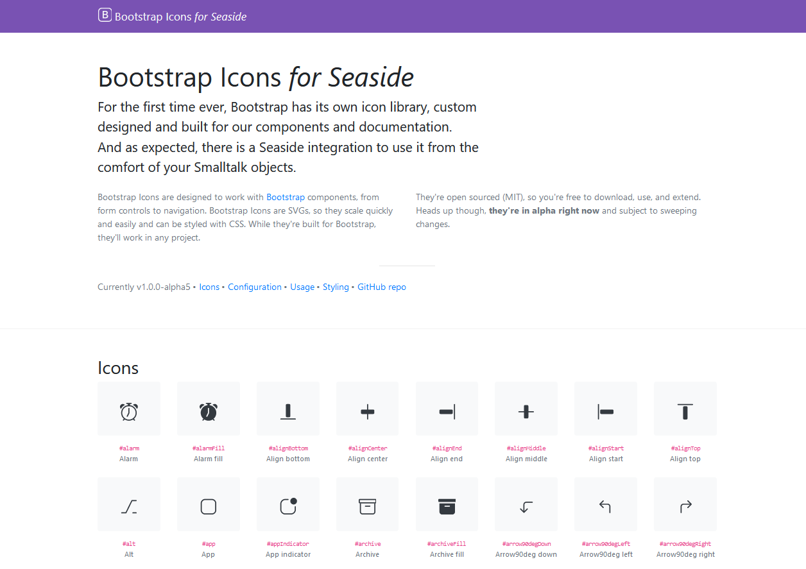

# Introduction
[Seaside](https://github.com/SeasideSt/Seaside) classes, extensions and file library for [Bootstrap SVG Icons](https://icons.getbootstrap.com/)

# Installation

```smalltalk
Metacello new 
  baseline: 'BaselineOfBootstrap4Icons'; 
  repository: 'github://eMaringolo/seaside-bootstrap4-icons/src'; 
  load.
  ```

# Examples browser

Once you installed the baseline, it will come with the canvas extensions and classes, the file library, tests and an example browser available at `http://localhost:8080/bootstrapIcons`.


